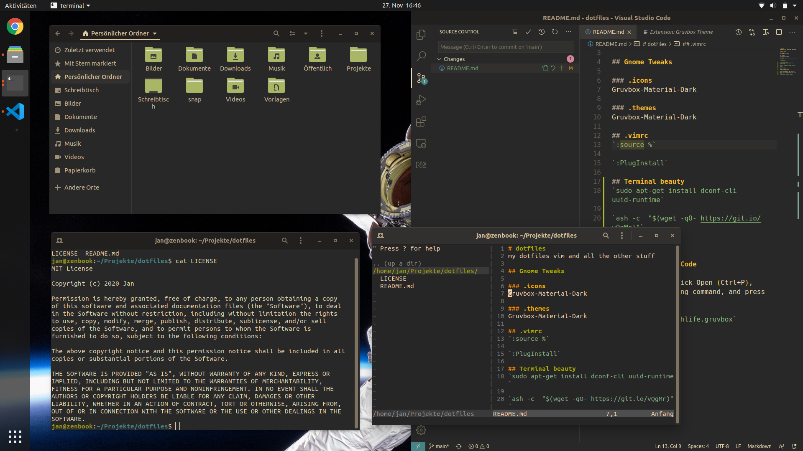

# dotfiles
my dotfiles vim and all the other stuff

## Gnome Tweaks

### .icons
Gruvbox-Material-Dark

### .themes
Gruvbox-Material-Dark

## .vimrc
`:source %`

`:PlugInstall`

## Terminal beauty
`sudo apt-get install dconf-cli uuid-runtime`

`ash -c  "$(wget -qO- https://git.io/vQgMr)"`

select Gruvbox

## Visual Studio Code

Launch VS Code Quick Open (Ctrl+P), paste the following command, and press enter.

`ext install jdinhlife.gruvbox`